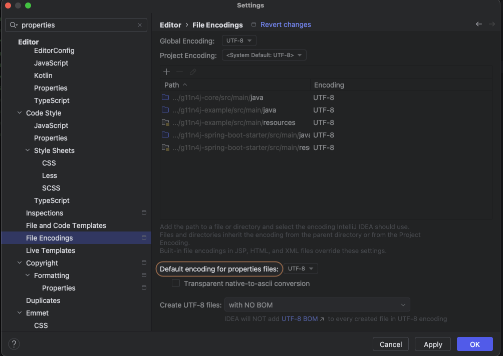

## Modules
* `g11n4j-core` - core module for pure Java
* `g11n4j-spring-boot-starter` - module for Spring Boot 3.x
* `g11n4j-example` - usage examples of g11n4j library

## Features:
* Pluralization rules using ICU4J
* Variable substitution like {name}, {count}
* Back compatibility support for array of variables like {0}, {1}
* Locale fallback chain (e.g., en_US → en → default)
* Spring Boot integration

### Supported formats:
* `YAML` - YAML Ain't Markup Language (.yaml, .yml)
* `Properties file` - is mainly used in Java-related technologies to store the configurable parameters of an application (.properties)
* `Gettext` - is a software internationalization and localization (i18n and l10n) system commonly used for creating multilingual programs, particularly on Unix-like systems (.po)
* `RDBMS` (MySQL, PostgreSQL, Oracle etc.)
* `NoSQL` (MongoDB)
* `TMX` - Translation Memory eXchange is a standard XML-based file format used in the translation industry for storing and exchanging translation memory data
* `XLIFF` - XML Localization Interchange File Format is a standardized file format used to exchange localization data between tools and systems.


---
## Pluralization
| Special keyword | Meaning                               |
|-----------------|---------------------------------------|
| zero            | Used in some languages (e.g., Arabic) |
| one             | Singular form (e.g., 1 notification)  |
| two             | Dual form (e.g., 2 in Arabic, Hebrew) |
| few             | For low numbers (e.g., 2-4 in Russian) |
| many            | For large numbers (e.g., 5+ in Russian) |
| other           | Fallback/default |

### YAML pluralization example:

`messages_en.yml`
```yaml
notification:
  message:
    count:
      one: "You have {count} unread notification"
      other: "You have {count} unread notifications"
```

Output:

> You have 1 unread notification  
You have 15 unread notifications


---
`messages_ru.yml`
```yaml
notification:
  message:
    count:
      one: "У вас {count} непрочитанное уведомление"
      few: "У вас {count} непрочитанных уведомления"
      many: "У вас {count} непрочитанных уведомлений"
```

Output:

>У вас 1 непрочитанное уведомление  
У вас 2 непрочитанных уведомления  
У вас 5 непрочитанных уведомлений  
У вас 91 непрочитанное уведомление  
У вас 86 непрочитанных уведомлений  
У вас 73 непрочитанных уведомления

## Spring Boot integration example:
* Add `g11n4j-spring-boot-starter` dependency to the classpath 
* Inject MessageResolver bean to your code like:
```java
@Service
public class UserServiceImpl implements UserService {
    
    @Autowired
    private MessageResolver messageResolver;
    
    // omitted for brevity ...
}
```

---
> Check unit tests under `src/test` folder for usage examples

## Troubleshooting:

---
### Internationalization (`i18n`) and `.properties` Files
To ensure our application supports multiple languages correctly, all `.properties` files containing text (especially for translations) **must be saved with UTF-8 encoding**.
#### Why UTF-8?
The default encoding for `.properties` files in older Java versions was ISO-8859-1, which cannot store characters for many languages (e.g., Cyrillic, Greek, Chinese). Using UTF-8 allows us to write translations directly in any language without needing special escape sequences.
#### How to Work with Properties Files
Always ensure your text editor or IDE is configured to save `.properties` files as **UTF-8**.
* In IntelliJ IDEA, you can set this in `Settings/Preferences > Editor > File Encodings` > `Default encoding for properties files`



---
## Useful links:
* [PoEdit](https://poedit.net/) - Poedit provides translators and developers with a powerful and intuitive editor for many file formats: gettext/PO, XLIFF, JSON or Flutter.
